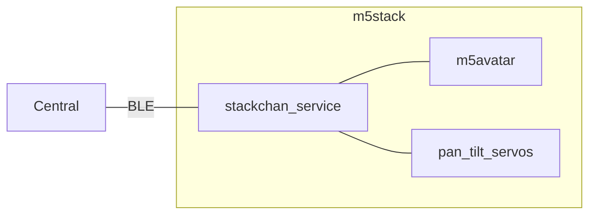
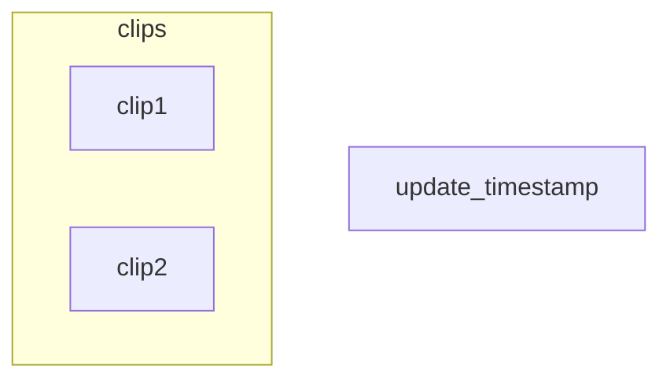

# Stackchan BLE

[](https://github.com/botamochi6277/stackchan-ble/actions/workflows/ci-platformio.yml)

Super kawaii stackchan controlled with BLE



## Service Detail

```json
{
  "name": "StackchanService",
  "uuid": "671e0000-8cef-46b7-8af3-2eddeb12803e",
  "characteristics": [
    {
      "name": "timer_chr",
      "uuid": "671e0001-8cef-46b7-8af3-2eddeb12803e",
      "data_type": "UnsignedLong",
      "properties": ["Read", "Notify"]
    },
    {
      "name": "facial_expression_chr",
      "uuid": "671e1000-8cef-46b7-8af3-2eddeb12803e",
      "data_type": "UnsignedChar",
      "properties": ["Read", "Write"]
    },
    {
      "name": "is_servo_activated_chr",
      "uuid": "671e2000-8cef-46b7-8af3-2eddeb12803e",
      "data_type": "Boolean",
      "properties": ["Read", "Write"]
    },
    {
      "name": "servo_pan_angle_chr",
      "uuid": "671e2001-8cef-46b7-8af3-2eddeb12803e",
      "data_type": "UnsignedChar",
      "properties": ["Read", "Write"]
    },
    {
      "name": "servo_tilt_angle_chr",
      "uuid": "671e2002-8cef-46b7-8af3-2eddeb12803e",
      "data_type": "UnsignedChar",
      "properties": ["Read", "Write"]
    }
  ]
}
```

## Animation


