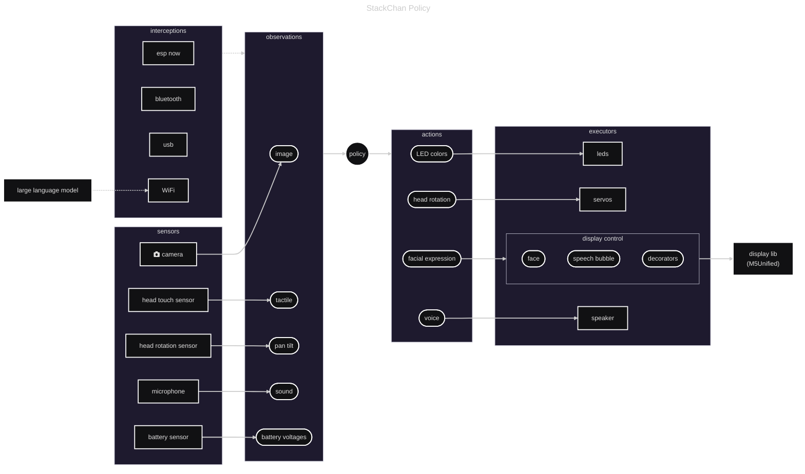

# StackChan policy

Draft for policy models

```mermaid
---
config:
  theme: 'redux-dark'
title: 'StackChan Policy'
---
graph LR

%% sensor inputs

subgraph sensors
    camera[fas:fa-camera camera]
    touch[head touch sensor]
    head_rot[head rotation sensor]
    mic[microphone]
    bat[battery sensor]
end 

subgraph observations
    cam_image([image])
    tactile([tactile])
    joint_pos([pan tilt])
    sound([sound])
    bat_lv([battery voltages])
end
camera-->cam_image
touch-->tactile
head_rot-->joint_pos
mic-->sound
bat-->bat_lv
%% comm inputs


subgraph interceptions
    esp_now[esp now]
    ble[bluetooth]
    usb[usb]
    wifi[WiFi]
end
%% extra

llm[large language model]-.->wifi
interceptions-.->observations

%% outputs


subgraph display[display control]
    face([face])
    speech([speech bubble])
    decorators([decorators])
end

display-->display_lib["display lib<br/>(M5Unified)"]

%%mot-->servo_lib[servo lib]

%% head neopixels on M5StackChan Head
%%head_led[head LED control]
%%head_led-->led_lib[LED lib]


subgraph actions
    led_colors([LED colors])
    head_act_rot([head rotation])
    facial_expression([facial expression])
    voice([voice])
end

subgraph executors
    leds
    servos
    speaker
    display
end

led_colors-->leds
head_act_rot-->servos
voice-->speaker
facial_expression-->display

policy((policy))
observations-->policy-->actions

```

How to train the policy?
To use imitation learning, reference motions are required. Someone should be stackchan during a few days
